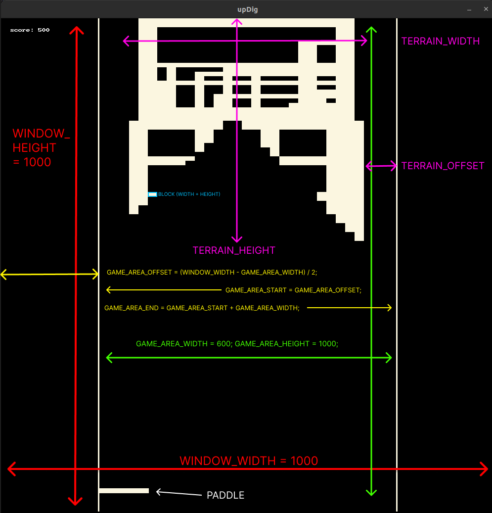

### Building Graphical Applications With Splashkit

___

# BreakIn: A Game Development Tutorial

#### Table of Contents

- **[Introduction](#introduction)**
  - Overview of BreakIn
  - Setting up the development environment
- **[The Event Loop](#the-event-loop)**
  - Understanding the main game loop
  - Event handling and game flow
- **[Detour - Utility Functions](#detour---utility-functions)**
  - Implementing utility functions for game development
  - Rolling our own XOR PRNG
- **[Setting Up Global Constants](#setting-up-global-constants)**
  - Defining constants for screen dimensions and gameplay settings
  - Organizing global constants for easy access and modification
- **[Global State Management](#global-state-management)**
  - Designing the global state structure
  - Managing game-wide states and settings
- **[Basic Game Entities](#basic-game-entities)**
  - Defining instance structures for game objects
  - Abstracting common functionalities
- **[Initialising Game Entities](#initialising-game-entities)**
  - Creating instances of game objects
  - Initialising states for gameplay
- **[Updating State and Looping Back](#updating-state-and-looping-back)**
  - Handling state changes during gameplay
  - Integrating state updates with the event loop
- **[Physics and Terrain Generation](#physics-and-terrain-generation)**
  - Implementing basic physics for movement and collision
  - Generating dynamic terrain for gameplay
- **[Juice, Particles, and Color](#juice-particles-and-color)**
  - Enhancing the game with visual effects
  - Adding particle systems for dynamic interactions
  - Incorporating color and graphics enhancements
- **[Conclusion](#conclusion)**
  - Recap and next steps for game development

---

# Introduction

BreakIn is a game development project that explores basic game design patterns and implementations, walking you through building something that combines classic arcade gameplay with some procedural generation and programmatic drawing techniques. This tutorial will guide you through the development process, leveraging SplashKit as the graphics engine.

Our initial goal is to create a simple breakout-style game where the player controls a paddle to bounce a ball and break ***an endless stream*** of blocks. We will start with the core game loop, event handling, and state management, then gradually introduce more complex features like physics, terrain generation, and visual effects.

**note:** This tutorial uses a combination of imperative and functional / declarative patterns to encapsulate and inform functionality, this is a personal choice by me based on both the implementation language and my general distaste for object oriented design patterns. That said, the concepts and broad implementation patterns covered from here on out can easily be applied to an object oriented approach.
## Setting up the development environment

To begin, ensure you have the necessary tools and libraries installed:

1. **SplashKit SDK:** Download and install the SplashKit SDK from [the official website](https://www.splashkit.io/).

2. **C++ Compiler:** Ensure you have a C++ compiler set up. For Windows, you can use MinGW or Visual Studio. For macOS and Linux, GCC or Clang are good options.

3. **IDE:** While not mandatory, an Integrated Development Environment (IDE) like Visual Studio Code or CLion (Jetbrains) can streamline your development process.

Once you have the environment set up, clone the BreakIn repository to your local machine and compile it:

```bash
git clone https://github.com/p4stoboy/Generative-Breakout.git
```

```bash
cd Generative-Breakout
smk g++ *.cpp -o game
```

Run the compiled executable to ensure everything is working correctly. You should see the game window open to the menu. Congratulations, you're now ready to dive into the development of BreakIn!

# The Event Loop

At the heart of BreakIn—and indeed, any game development project—lies the event loop, a perpetual cycle that processes input, updates game state, and renders the game frame by frame. This cyclical nature is how graphical applications implement a continuous experience, reflecting real-time interaction. Utilising SplashKit, we will delve into the functionality exposed by the event loop, unraveling its components and demonstrating how it functions as the game's central nervous system.

## Understanding the Main Game Loop

The main game loop is a fundamental paradigm that drives game execution. It encompasses three critical stages: processing input, updating game state, and rendering.

- **Input**: Capturing and interpreting player actions as meaningful game commands.
- **Update**: Adjusting the game state in response to input, time passage, and internal logic.
- **Render**: Drawing the visual representation of the current game state onto the screen.

Each iteration of the loop is a snapshot, a single frame in the game's lifespan. As such, it must be both efficient and comprehensive to maintain the illusion of continuity.

## Event Handling and Game Flow

SplashKit simplifies event management, providing a structured approach to handling user input and system events. **note:** The comments in the code block below are for the purposes of the tutorial.

**program.cpp**

```cpp
// import
#include "splashkit.h"

// we will declare these in header files later
void update_game();
void draw_game();

int main()
{
    // Open the window to begin the game
    open_window("BreakIn", 800, 600);

    // Main game loop: continues to run until the window is closed
    while (!window_close_requested())
    {
        // Ingest input from peripheral devices
        process_events();

        // Update game state values (we will implement this routine ourselves)
        update_game_state();

        // Draw to frame buffer (we will also implement this)
        draw_game();

        // Refresh at target frames per second
        refresh_screen(60);
    }

    // Close the game window and clean up resources
    close_window("BreakIn");

    return 0;
}
```

Within this loop, you will integrate logic to react to keyboard strokes, mouse movements, and other player inputs. `process_events` function serves as the dispatcher, funneling input in to scope.
`update_game_state` mutates the game's state, readying it for the next frame's visual portrayal.
`draw_game` will invoke functions to generate the next frame of the game.
`refresh_screen` concludes the cycle by presenting the updated state to the player.

---

This section establishes the importance of the event loop and provides a foundation against which we can start designing implementations. In the following sections, we will populate this loop with the functionality described above.

Section 3 will focus on how to effectively manage the global state of the game. This includes organizing the different states that your game can be in (such as menu, playing, paused, or ended), as well as the state of game object instances like the player / anything else which has mutable properties, and how these states are maintained and transitioned between as the game progresses.

We will explore creating a structured and easily manageable state system, incorporating conventions which enforce composable and extendable code. We'll examine how to encapsulate the game state, manage transitions, and effectively control game flow.

This will set the foundation for the more intricate features of your game and ensure that all components work cohesively to create a seamless gaming and development experience.

# Detour - Utility Functions

Before diving into the core game development concepts, we'll quickly implement a couple of helpful functions that we'll use later, as well as our own PRNG type which is the only object with member functions we'll implement directly in this tutorial. The reason for this is that a PRNG is one of the only abstractions where I can confidently say encapsulation of functionality and state is the best design approach (it needs to be portable, expose a consistent interface, and maintain its own state throughout the application lifetime). The rest of our functionality will be implemented as functions which take in and return data structures, this is to keep our code as simple and composable as possible.

## Utility Functions in BreakIn

### XORShift PRNG

**XOR.h**
```cpp
#pragma once

#include <cstdint>
#include <algorithm>
#include <stdexcept>
#include <limits>
#include <vector>

/**
 * @brief Simple random number generator based on XOR shift algorithm.
 */
struct XOR {
    /**
     * @brief Constructor for XOR random number generator.
     * @param initialSeed The initial seed value for the generator.
     */
    XOR(uint32_t initialSeed = 0x77777777);

    /**
     * @brief Generates a random integer in the range [min, max].
     * @param min The minimum value of the range.
     * @param max The maximum value of the range.
     * @return A random integer in the specified range.
     */
    inline int randomInt(int min, int max);

    /**
     * @brief Generates a random float in the range [min, max].
     * @param min The minimum value of the range.
     * @param max The maximum value of the range.
     * @return A random float in the specified range.
     */
    inline float randomFloat(float min = 0.0f, float max = 1.0f);

    /**
     * @brief Generates a boolean value with a given probability of being true.
     * @param probability The probability of returning true (0.0f to 1.0f).
     * @return true with the specified probability, false otherwise.
     */
    inline bool chance(float probability = 0.5f);

    /**
     * @brief Chooses a random element from a vector.
     * @param vec The vector from which to choose.
     * @return A random element from the vector.
     * @throws std::invalid_argument if the vector is empty.
     */
    template<typename T>
    inline T choose(const std::vector<T>& vec);

    /**
     * @brief Chooses a random element from an array.
     * @param arr The array from which to choose.
     * @return A random element from the array.
     */
    template<typename T, size_t N>
    inline T choose(const T (&arr)[N]);

private:
    /**
     * @brief Generates the next random number in the sequence.
     * @return The next random number.
     */
    inline uint32_t next();

    uint32_t seed; ///< The current seed value for the generator.
};

// Inline function definitions

inline XOR::XOR(uint32_t initialSeed) : seed(initialSeed) {}

inline uint32_t XOR::next() {
    seed ^= seed << 13;
    seed ^= seed >> 17;
    seed ^= seed << 5;
    return seed;
}

inline int XOR::randomInt(int min, int max) {
    if (max < min) {
        std::swap(min, max);
    }
    uint32_t range = static_cast<uint32_t>(max - min + 1);
    return min + static_cast<int>(next() % range);
}

inline float XOR::randomFloat(float min, float max) {
    float normalized = next() * (1.0f / 4294967296.0f);
    return min + normalized * (max - min + std::numeric_limits<float>::epsilon());
}

inline bool XOR::chance(float probability) {
    return randomFloat() < probability;
}

template<typename T>
inline T XOR::choose(const std::vector<T>& vec) {
    if (vec.empty()) {
        throw std::invalid_argument("Vector is empty");
    }
    int index = randomInt(0, vec.size() - 1);
    return vec[index];
}

template<typename T, size_t N>
inline T XOR::choose(const T (&arr)[N]) {
    return arr[randomInt(0, N - 1)];
}

```
This looks complex but it's a simple declaration for an [XORShift](https://en.wikipedia.org/wiki/Xorshift) PRNG, it's small and has a very good period (the number of unique values it can generate before repeating) for a 32-bit PRNG. It is a perfectly simple interface for our purposes.

**Why not use an inbuilt C++ prng?**

We only really need a simple interface for generating random numbers, and the inbuilt PRNGs in C++ are often more complex than we need. We also want to be able to control the seed of our PRNG, which is not always possible with the inbuilt PRNGs. Mainly, though, I just like this implementation.

So aside from seeding the constructor (which we will cover later), the PRNG exposes 4 public methods:

`randomInt(min, max)` which returns a random integer between `min` and `max` (inclusive).

`randomFloat(min, max)` which returns a random float between `min` and `max` (inclusive).

`chance(probability)` which returns a boolean based on the probability (`min: 0.0, max: 1.0`) passed in.

`choose(vec)` and `choose(arr)` which return a random element from a vector or array respectively (these are Template (Generic) functions, they are called exactly the same).

You don't need to worry about the implementation of these functions, just know that a single XOR instance will be declared with our globals and will be used throughout the application.

We will also implement a couple of utility functions in a new file called `util.h` which will be used throughout the game.

**note:** Both of these header files contain inline definitions as well as the declarations, this is because the functions don't really help extend or interface with other code (and so it doesn't make sense to define them alongside other related patterns), they are just small utilities which we want to inline for performance and simplicity.
In the rest of the tutorial we will be decoupling our definitions from our implementation, this is just a small exception.

**util.h**
```cpp
#pragma once

#include "splashkit/splashkit.h"
#include "stdio.h"
#include <stdexcept>

/**
 * @brief Convert a hex string to a color.
 *
 * @param hex The hex string.
 * @return color The color.
 */
inline color color_from_hex(const std::string& hex) {
    int r, g, b;
    sscanf(hex.c_str(), "#%02x%02x%02x", &r, &g, &b);
    return rgb_color(r, g, b);
}

/**
 * @brief Map a value from one range to another.
 *
 * @param value The value to map.
 * @param input_min The input minimum.
 * @param input_max The input maximum.
 * @param output_min The output minimum.
 * @param output_max The output maximum.
 * @return double The mapped value.
 */
inline double map_value(double value, double input_min, double input_max, double output_min, double output_max) {
    // Calculate the ratio between the input range and output range
    double scale = (output_max - output_min) / (input_max - input_min);
    // Map the value to the new range
    return output_min + (value - input_min) * scale;
}

/**
 * @brief Clamp a value between a low and high value.
 *
 * @tparam T The value type.
 * @param value The value to clamp.
 * @param low The low value.
 * @param high The high value.
 * @return T The clamped value.
 */
template<typename T>
T clamp(const T& value, const T& low, const T& high);

template<typename T>
T clamp(const T& value, const T& low, const T& high) {
    return (value < low) ? low : (value > high) ? high : value;
}
```

Briefly, these 3 functions are:

`color_from_hex(hex)` which takes a hex string and returns a Splashkit color object (very useful when working with colour tools like [p4lette](https://p4lette.app)).

`map_value(value, input_min, input_max, output_min, output_max)` which maps a value from one range to another (useful for scaling values).

`clamp(value, low, high)` which clamps a value between a low and high value (useful for ensuring values are within a certain range).

These functions are simple and will be used throughout the game to simplify and abstract some common operations.

Next we will look at how to set up the constant values which will help define our game space.

# Setting Up Global Constants

Global constants are where we define the overall settings and configurations of the game. We'll use `globals.h` to declare *and* define these constants as we are using some operators (`inline constexpr`) which require a value to be known at compile time / defined in a header.

You do not necessarily have to use this pattern, it's fine to use `extern const` and define the values in a source file, or simply define these values as `const` in a header file. The important thing is that you maintain a single source of truth for these values.
This is a good practice as it allows us to easily modify the game's settings from a central location.

### globals.h

In `globals.h`, we declare global **constants** (immutable values) that will be used throughout the game. This header file acts as a central point of reference for all global settings. We maintain these separately from our gamestate struct as they are **not mutable** values, they function as universal rules which our gameplay systems are implemented against and as such they should be abstracted as far away from our mechanical functionality as possible.

**globals.h**

```cpp
#pragma once

#include "splashkit/splashkit.h"
#include "XOR.h"
#include "util.h"

/**
 * @brief The global window dimensions.
 *
 */
inline constexpr int WINDOW_WIDTH = 1000;
inline constexpr int WINDOW_HEIGHT = 1000;

/**
 * @brief The global game area dimensions.
 *
 */
inline constexpr int GAME_AREA_WIDTH = 600;
inline constexpr int GAME_AREA_HEIGHT = 1000;
inline constexpr int GAME_AREA_OFFSET = (WINDOW_WIDTH - GAME_AREA_WIDTH) / 2;
inline constexpr int GAME_AREA_START = GAME_AREA_OFFSET;
inline constexpr int GAME_AREA_END = GAME_AREA_START + GAME_AREA_WIDTH;

/**
 * @brief The global terrain dimensions and offsets relative to window.
 *
 */
inline constexpr int TERRAIN_OFFSET = GAME_AREA_OFFSET + GAME_AREA_WIDTH / 10;
inline constexpr int TERRAIN_WIDTH = GAME_AREA_WIDTH - GAME_AREA_WIDTH / 5;
inline constexpr int TERRAIN_HEIGHT = TERRAIN_WIDTH;

/**
 * @brief Terrain dimensions
 *
 */
inline constexpr int NUM_ROWS = 50;
inline constexpr int NUM_COLS = 25;

/**
 * @brief The global block dimensions inside the Terrain Grid.
 *
 */
inline constexpr int BLOCK_WIDTH = TERRAIN_WIDTH / NUM_COLS;
inline constexpr int BLOCK_HEIGHT = TERRAIN_HEIGHT / NUM_ROWS;

inline constexpr float BLOCK_POWERUP_CHANCE = 0.02;
inline constexpr int INITIAL_PADDLE_WIDTH = WINDOW_WIDTH / 10;
inline constexpr int MAX_PADDLE_WIDTH = INITIAL_PADDLE_WIDTH * 2;
inline constexpr int MIN_PADDLE_WIDTH = INITIAL_PADDLE_WIDTH / 2;


// rng
/**
 * @brief The global random number generator.
 *
 */
inline XOR rng = XOR();

/**
 * @brief The game palette.
 *
 */
const color clr_background = color_from_hex("#000000");
const color clr_paddle = color_from_hex("#FBF6E0");
const color clr_block = color_from_hex("#FBF6E0");
const color clr_ball_standard = color_from_hex("#FBF6E0");
const color clr_ball_explosion = color_from_hex("#FF2727");
const color clr_ball_acid = color_from_hex("#AFFF26");
```

Most of these are spatial parameters which will be used to define the game space and the entities within it. We also define some colors which will be used to render the game entities. The global `XOR` PRNG instance is also declared here, as are the color objects which inform the game palette.

There is a lot going on here which you don't need to worry too much about, these variables are defined relative to each other so that changes to the overall dimensions of the game space are reflected in the dimensions of the entities within it.

Just to show you how these values are being used, and why there are so many of them, let's fast forward and have a look at this breakdown of the game screen:



Take your time to get a feel for how these values are being used relative to each other, and have a think about what else they might be used for later in our development.

Now we can edit our main file to use some these variables during window instantiation.

**program.cpp**

```cpp
// import
#include "splashkit.h"
#include "globals.h" // <- added this import

// we will declare these in header files later
void update_game();
void draw_game();

int main()
{
    // Open the window to begin the game
    // using new global constants
    open_window("BreakIn", WINDOW_WIDTH, WINDOW_HEIGHT);

    // Main game loop: continues to run until the window is closed
    while (!window_close_requested())
    {
        // Ingest input from peripheral devices
        process_events();

        // Update game state values (we will implement this routine ourselves)
        update_game_state();

        // Draw to frame buffer (we will also implement this)
        draw_game();

        // Refresh at target frames per second
        refresh_screen(60);
    }

    // Close the game window and clean up resources
    close_window("BreakIn");

    return 0;
}
```

In later sections, we'll access these global constants to during the initialisation of some of our game entities.

# Global State Management

In BreakIn, we use a struct to encapsulate our mutable game data, which most functions we will implement later accept a reference to as an argument. This allows for extremely granular and high-level control over what state is updated and when, and forces us to be more accountable when we implement patterns which mutate state. By explicitly requiring the game state to be passed as an argument, it keeps the function's dependencies clear and makes it easy to see how the game state is being modified.

### Implementing GameState

With our `GameState` struct, we can start defining the variables that will hold the game's mutable data. For now, we'll keep it simple with just a couple of variables, but this will expand as we add more features to the game.

```cpp
struct GameState {
    int score;
    // Additional game state variables will be added here
};
```

### GameStatus Enum

In addition to the `GameState` struct, we have the `GameStatus` enum to represent the high-level states of the game, such as whether the game is in the menu, in play, paused, or has ended.

```cpp
enum GameStatus {
    MENU,
    PLAYING,
    PAUSED,
    ENDED
};
```

This enum type will be used to control the flow of the game and determine which high-level control pattern should be executed at any given time.

Now we can extend our `GameState` definition to include a GameStatus struct as a member variable, as it constitutes part of our mutable state.

```cpp
struct GameState {
    int score;
    GameStatus game_status;
    // Additional game state variables will be added here
};
```

Finally, we will define these structs inside a new header filed called `types.h` located in our root directory.

**types.h**

```cpp
#pragma once // linker flag

enum GameStatus {
    MENU,
    PLAYING,
    PAUSED,
    ENDED
};


struct GameState {
    int score;
    GameStatus game_status;
    // Additional game state variables will be added here
};
```

We will cover instantiating and updating this state in later sections, for now let's think about what minimum functionality our game needs and go about implementing it.

## Basic Game Entities

With the global state management set up, we can now define the basic entities in BreakIn: blocks, balls, and the paddle. These entities will have minimal properties to begin with.

### Block Struct

The `Block` struct represents the individual blocks that the player aims to break with the ball. Each block has an active state and a position.

```cpp
struct Block {
    bool active;
    point_2d pos;
};
```

### Paddle Struct

The `Paddle` struct represents the player's paddle, which can move horizontally. The paddle has a position.

```cpp
struct Paddle {
    point_2d pos;
};
```

### Ball Struct

The `Ball` struct represents the projectiles which collide with the paddle and with blocks. Each ball has an active state, a position, and a velocity.

```cpp
struct Ball {
    bool active;
    point_2d pos;
    vector_2d vel; // velocity along x and y axes
};
```

**note:** `point_2d` and `vector_2d` are datatypes exposed by Splashkit and can be referenced in any file that imports the Splashkit library, they are both structs which look like:

```cpp
struct {
    float x;
    float y;
}
```

Now we can update our `types.h` file to look like:

```cpp
#pragma once // linker flag

#include "splashkit.h";

struct Ball {
    bool active;
    point_2d pos;
    vector_2d vel; // velocity along x and y axes
};

struct Paddle {
    bool active;
    point_2d pos;
};

struct Block {
    bool active;
    point_2d pos;
};

enum GameStatus {
    MENU,
    PLAYING,
    PAUSED,
    ENDED
};

struct GameState {
    int score;
    GameStatus game_status;
    // Additional game state variables will be added here
};
```

So, we are creating a system of entity types which will exist (based on their `pos` (position) property) in an abstract space (which we defined above) when instantiated. This abstract space is independent of any visual representation; it is a conceptual framework where our game objects interact and change state based on the game's rules and logic.

In essence, we are simulating a system of interactions and changes in the background, driven solely by the values and states of our entities. It is only at each time step that this abstract system is translated into a rendered frame, providing the visual representation of our game on the screen. For instance, while our position vectors currently correspond 1:1 with pixel positions within the game window, we could easily make our abstract space much bigger or smaller than the space our internal values correspond to, and draw their graphics against some function of the differential between the two spaces (ie. double the position vector before drawing if the screen space is 2:1 our abstract space).

The game's logic and mechanics are maintained completely separately from, and only interact with our render in one direction (nothing in our draw functions will mutate the state of the game).

With that in mind, let's look at how we can place stuff in this space.

# Initialising Game Entities

With our basic game entities and global constants set up, we can now focus on initialising the game state and individual entities like the paddle, balls, and blocks.

We will use top-level functions to instantiate game entities such as the paddle, ball, and blocks, instead of using class constructors. This design choice is aligned with our functional programming approach, which emphasises the use of functions to create and manipulate data.

One of the reasons for this approach is to maintain a clear separation between the game entities (represented by structs) and the logic used to create and manipulate them. By using top-level functions, we can keep our data structures simple and focused solely on holding data, while the functions handle the creation and initialisation logic.

In a new file (`state_init.h`) we will declare some initialisation functions.

**state_init.h**

```cpp
#pragma once // linker flag

#include "types.h"

Paddle new_paddle();
Ball new_ball(point_2d pos, vector_2d vel);
Block new_block(point_2d pos);
```

By making the paddle position (and below, dimensions) a function of our screen space (remember the paddle constants in `globals.h`), it means we can adjust the screen dimensions without worrying about the relative position and size of our paddle.

Then in `state_init.cpp` we can define the function bodies.

**state_init.cpp**

```cpp
#include "globals.h"
#include "state_init.h"

// new_paddle takes no arguments as all its properties
// are derived from global constant values
Paddle new_paddle() {
    Paddle paddle;
    // make paddle's initial position center-bottom
    paddle.x = WINDOW_WIDTH / 2;
    paddle.y = WINDOW_HEIGHT - 50;
    paddle.width = INITIAL_PADDLE_WIDTH;
    paddle.height = WINDOW_HEIGHT / 80;
    return paddle;
}

Ball new_ball(point_2d pos, vector_2d vel, int size) {
    Ball ball;
    ball.pos = pos;
    ball.vel = vel;
    ball.size = size;
    ball.active = true;
    return ball;
}

Block new_block(point_2d pos, int width, int height) {
    Block block;
    block.pos = pos;
    block.width = width;
    block.height = height;
    block.active = true;
    return block;
}
```

You will notice we are instantiating properties which we did not define in `types.h` against these structs, now would be a good time to add them. Both `Paddle` and `Block` will need `int` width and height properties while our `Ball`s will always be symmetrical and thus only require a `size` property. We're also adding a `color` property to each, `color` is a Splashkit type. These will be used to inform the draw and collision functions we will develop later:

**types.h**

```cpp
#pragma once

#include "splashkit.h"

struct Ball {
    bool active;
    point_2d pos;
    vector_2d vel;
    int size;
    color clr; // `color` is a Splashkit type
};

struct Paddle {
    point_2d pos;
    int width;
    int height;
    color clr;
};

struct Block {
    bool active;
    point_2d pos;
    int width;
    int height;
    color clr;
};

enum GameStatus {
    MENU,
    PLAYING,
    PAUSED,
    ENDED
};

struct GameState {
    int score;
    GameStatus game_status;
    // Additional game state variables will be added here
};
```

# Terrain Grid and Block positioning

Before we dive into updating the game state and handling collisions, let's take a moment to discuss the Grid system used to represent the blocks in the game, as well as the `ivec2` type and the purpose of each block storing its own grid position.

### Terrain Grid


In BreakIn, the blocks are organized in a 2D grid called terrain within the GameState struct. This grid is represented using a special data structure composed of a vector of vectors of unique pointers to Block instances.

**types.h**
```cpp
/**
 * @brief A Row is a vector of unique pointers to blocks.
 * @details A Row is used to represent a row of blocks in the game.
 */
using Row = std::vector<std::unique_ptr<Block>>;

/**
 * @brief A Grid is a vector of rows.
 * @details A Grid is used to represent the grid of blocks in the game.
 */
using Grid = std::vector<Row>;

// ...other types
```
The `Row` type is defined as a vector of unique pointers to `Block` instances. Each element in the `Row` vector represents a block in that row. The use of unique pointers ensures that each block is owned by the `Row` and will be automatically deleted when the `Row` is destroyed or the block is removed from the grid.
The `Grid` type is defined as a vector of `Row` instances. Each element in the `Grid` vector represents a row of blocks in the game. By combining these two types, we create a 2D grid structure that efficiently manages the blocks in the game.
Using this grid system provides several benefits:
- It allows for easy access and manipulation of blocks based on their row and column positions.
- The use of unique pointers ensures proper memory management and ownership of the blocks.
- It provides a clear and organized structure for representing the game's block layout.

### ivec2 Type and Block Grid Position
In addition to the grid system, each `Block` instance also stores its own grid position using the `ivec2` type. The `ivec2` type is a simple struct that represents a 2D vector with integer components.

**types.h**
```cpp
/**
 * @brief A 2D integer vector.
 * @details An ivec2 is used to represent a 2D vector with integer components.
 */
struct ivec2 {
    int x, y;
};

// ...other types
```
By storing the grid position internally within each Block instance, we can easily identify the row and column of the block within the grid. This information is useful for various purposes, but fundamentally it gives us a way to find the block in the `Grid` when we encounter it based on its position in the game space.

Updated version of the `Block` struct that includes the grid_pos member:

**types.h**
```cpp
struct Block {
    bool active;
    point_2d pos;
    int width;
    int height;
    color clr;
    ivec2 grid_pos;
};
```
**state_init.h**
```cpp
// ...other declarations
Block new_block(point_2d pos, ivec2 grid_pos, int width, int height, color clr);
```
**state_init.cpp**
```cpp
// ...rest of file
Block new_block(point_2d pos, ivec2 grid_pos, int width, int height, color clr) {
    Block block;
    block.pos = pos;
    block.grid_pos = grid_pos;
    block.width = width;
    block.height = height;
    block.active = true;
    block.clr = clr;
    return block;
}
```
The `grid_pos` member stores the row and column position of the block within the grid.
With this understanding of the grid system and block positioning, let's proceed to update the GameState struct and implement the state update functions.

### Updating the GameState Struct
We'll update the GameState struct in the types.h file to include vectors for the balls and terrain, as well as our player `Paddle`.

**types.h**
```cpp
// ...other types

struct GameState {
    int score;
    GameStatus game_status;
    Paddle paddle;
    std::vector<Ball> balls;
    Grid terrain;
};
```

# Populating the Grid

For now, we'll just write a function to return a fully populated `Grid`. Later we'll extend this to be more dynamic but right now we just want to get something on the screen.
### new_grid()
**state_init.h**
```cpp
// ...other declarations
Grid new_grid();
```
**state_init.cpp**
```cpp
// ...rest of file
Grid new_grid() {
    Grid grid;
    for (int y = 0; y < NUM_ROWS; ++y) {
        // create a new row (which is a vector of Blocks remember)
        Row row;
        for (int x = 0; x < NUM_COLS; ++x) {
            // assign world position based on global constants
            point_2d pos = {static_cast<double>(TERRAIN_OFFSET + x * BLOCK_WIDTH), static_cast<double>(y * BLOCK_HEIGHT)};
            // discrete position in grid structure
            ivec2 grid_pos = {x, y};
            row.push_back(std::make_unique<Block>(new_block(pos, grid_pos, BLOCK_WIDTH, BLOCK_HEIGHT, clr_block)));
        }
        grid.push_back(std::move(row));
    }
    return grid;
}
```


Now that we have our entities defined and initialisation functions set up, we can move on to updating the game state and looping back to the event loop.
We will implement very basic state updates in the next section so that we can get something happening on screen, and then move on to more complex interactions and game logic.


